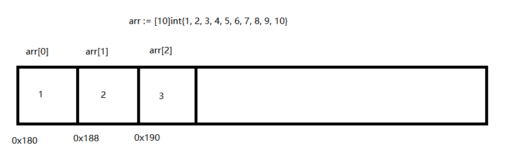

## 数组介绍

> + 一组具有相同数据类型在内存中 `有序存储` 的数据集合
> + 数组的长度在定义后不可以修改
> + 数组是值类型，赋值和传参会复制整个数组，而不是指针。因此改变副本的值，不会改变本身的值
> + 值拷贝行为会造成性能问题，通常会建议使用 slice，或数组指针

```go
	//数组定义和使用
	//var 数组名 [元素个数]数据类型
	//var arr [10]int//默认值为0
	//var array [5]*int // 指针类型
	// var array = [...]int{1,2,3,4,5} // 长度根据初始化确定
	////使用数组名+下标进行数组初始化   下标是从0开始的到数组最大元素个数-1
	//arr[0] = 123
	//arr[-1] = 123 //err 数组下标越界 panic

	//var arr [10]int = [10]int{1, 2, 3, 4, 5, 6, 7, 8, 9, 10}
	arr := [10]int{1, 2, 3, 4, 5, 6, 7, 8, 9, 10}
	//fmt.Println(arr)
	//len(数组名) 计算数组元素个数
	//fmt.Println(len(arr))

	//遍历数组元素
	//for i := 0; i < len(arr); i++ {
	//	fmt.Println(arr[i])
	//}
	//i index 下标 v value 值
	for i, v := range arr {
		fmt.Println(i, v)
	}
```


## 多维数组

```go
    a := [2][3]int{{1, 2, 3}, {4, 5, 6}}
    b := [...][2]int{{1, 1}, {2, 2}, {3, 3}} // 第 2 纬度不能用 "..."
```


## 数组内存存储方式

数组内存存储方式示意图(64位操作系统)：



```go
func main() {
	arr := [10]int{1, 2, 3, 4, 5, 6, 7, 8, 9, 10}

	fmt.Printf("%p\n", &arr)  // 数组的指针为第一个值的地址（首地址）
	for i := 0; i < len(arr); i++ {
		//& 取地址运算符
		fmt.Println(&arr[i])
	}
}
```
