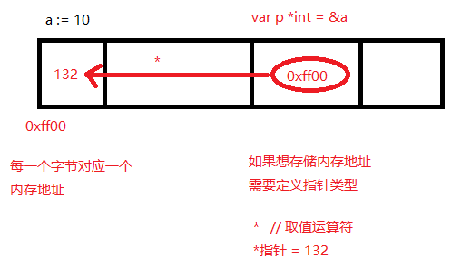
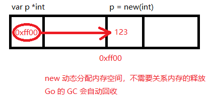

## 指针操作

> + `&`（取地址）和 `*`（根据地址取值）
> + 对变量进行取地址 `&` 操作，可以获得这个变量的指针变量
> + 指针变量的值是指针地址
> + 对指针变量进行取值 `*` 操作，可以获得指针变量指向的原变量的值

```go
	// 只要将数据存储在内存中都会为其分配内存地址。内存地址使用十六进数据表示
	// 内存为每一个字节分配一个32位或64位的编号（与32位或者64位处理器相关）

	a := 10
	//取出变量a在内存的地址
	//fmt.Println(&a)
	var p *int = &a
	//fmt.Println(p)
	//fmt.Println(&a)
	//通过指针间接修改变量的值
	*p = 132
	fmt.Println(a)

	//const MAX int = 100
	//fmt.Println(&MAX)//err 不可以获取常量的内存地址
```


## 指针类型内存存储方式




## 空指针

> 当一个指针被定义后没有分配到任何变量时，它的值为 nil


## new

```go
	//定义指针 默认值为nil 指向内存地址编号为0的空间  内存地址0-255为系统占用 不允许用户读写操作
	//var p *int // nil (空指针)
	//*p = 123 //err
	//fmt.Println(*p) //err

	//开辟数据类型大小的空间 返回值为数据类型对应的指针
	//new(数据类型)
	var p *int
	p = new(int)
	*p=123
	fmt.Println(*p) // 123
```


## new 操作-内存示意图




## new与make的区别

> 1. 二者都是用来做内存分配的
> 2. make只用于slice、map以及channel的初始化，返回的还是这三个引用类型本身
> 3. 而new用于类型的内存分配，并且内存对应的值为类型零值，返回的是指向类型的指针
