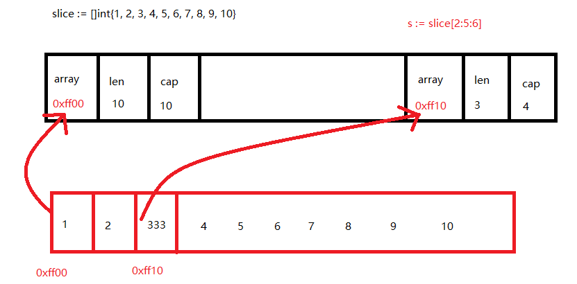

## 切片介绍

> + 一组具有相同数据类型在内存中 `有序存储` 的可扩容的数据集合
> + 切片是数组的一个引用，因此切片是引用类型。但自身是结构体，值拷贝传递


## 定义与使用

```go
	//切片的定义和使用
	//var 切片名 []数据类型
	//var slice []int
	//make([]数据类型，长度)
	//var slice []int = make([]int, 10)
	//slice[0] = 123
	//fmt.Println(slice)

	var slice []int
	fmt.Println(len(slice)) //计算长度 0
	fmt.Println(cap(slice)) //计算容量 0

	//使用append对切片进行扩容
	slice = append(slice, 1, 2, 3, 4, 5)
	fmt.Println(len(slice)) //计算长度 5
	fmt.Println(cap(slice)) //计算容量 6

	//切片扩容为偶数的值  小于1024 为上一次的两倍 大于1024为上一次的1/4
	fmt.Println(slice)
```


## 切片的截取

```go
	//切片的截取
	slice := []int{1, 2, 3, 4, 5, 6, 7, 8, 9, 10}

	//切片名[起始下标：结束下标：容量]  左闭右开 包含起始下标 不包含结束下标
	//s := slice[2:7]
	//fmt.Println(s)
	//s:=slice[2:]
	//fmt.Println(s)
	//s:=slice[:5]
	//fmt.Println(s)
	s := slice[2:5:6] //实际容量=容量-起始下标
	fmt.Println(s)

	//fmt.Println(len(s)) // 3
	//fmt.Println(cap(s)) // 4

	s[0] = 333
	//切片的截取 是将新的切片指向源切片的内存地址  修改一个会影响另外一个
	//但当切片的容量发生变化的时 扩容时 再修改的话就不会影响另一个
	fmt.Println(s)
	fmt.Println(slice)

	// 获取的都是底层切片结构体所占的字节大小
	fmt.Println(unsafe.Sizeof(slice)) // 24
	fmt.Println(unsafe.Sizeof(s)) // 24
```


## 切片截取-内存示意图




> 读写操作实际目标是底层数组

```go
    data := [...]int{0, 1, 2, 3, 4, 5}

    s := data[2:4]
    s[0] += 100
    s[1] += 200

    fmt.Println(s)
    fmt.Println(data)

    // 输出
    // [102 203]
    // [0 1 102 203 4 5]
```


## 二维切片

```go
    data := [][]int{
        []int{1, 2, 3},
        []int{100, 200},
        []int{11, 22, 33, 44},
    }
    fmt.Println(data)

    // 输出
    // [[1 2 3] [100 200] [11 22 33 44]]
```


## 切片的拷贝

```go
	slice := []int{1, 2, 3, 4, 5}

	//s := slice
	//s[2] = 333
	//fmt.Println(s)
	//fmt.Println(slice)
	//在存储存储两个内容完全相同 但是不会相互影响
	s := make([]int, 5)
	copy(s, slice)
	s[2]=333
	fmt.Println(s)
	fmt.Println(slice)
```